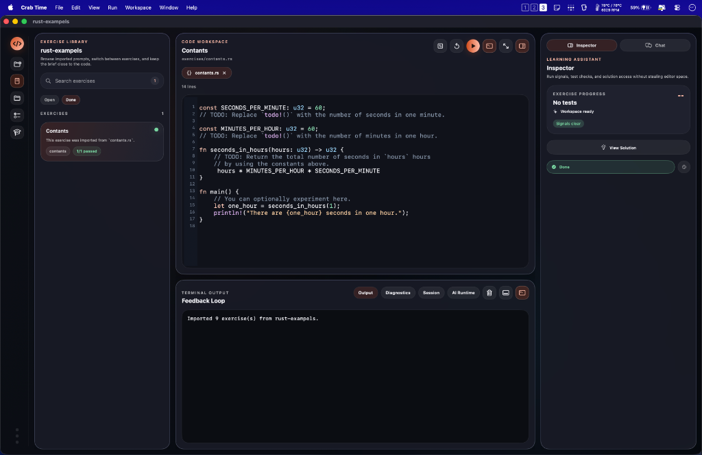

# Crab Time

> A native macOS Rust practice environment with an integrated AI coach, terminal, and submission pipeline.

Crab Time is a focused coding workspace built for Rust learners. It replaces browser-tab workflows with a tight native loop: edit code, run it, inspect diagnostics, ask an AI for help, and submit — without leaving the app.

## Screenshots




## Requirements

| Dependency | Version | Notes |
|---|---|---|
| macOS | 14.0 + | Required by Swift Observation framework |
| Xcode / Swift toolchain | Swift 6.2 + | `swift build` |
| Rust toolchain | stable | `rustc`, `cargo` |
| `cargo-runner` | latest | Installed automatically by Setup Wizard |
| `exercism` CLI | latest | Optional — required for Exercism integration |
| CodeCrafters CLI | latest | Optional — required for CodeCrafters integration |

> The **Setup Wizard** detects missing tools on first launch and offers to install them automatically.

---

## Installation

### Download (recommended)

1. Download the latest `.dmg` from [Releases](https://github.com/codeitlikemiley/crabtime/releases).
2. Drag **Crab Time.app** to `/Applications`.
3. Launch. The Setup Wizard handles any missing dependencies.

### Build from source

```bash
git clone https://github.com/codeitlikemiley/crabtime.git
cd crabtime

# Run directly (debug build)
make run

# Build a signed, notarized .dmg for distribution
# Requires .env with APPLE_ID, APPLE_TEAM_ID, RELEASE_SIGNING_IDENTITY, APP_PASSWORD
make publish

# Install to /Applications
make install

# Remove build artifacts and dist/
make clean
```

---

## Usage Examples

### Learning with Rustlings
CrabTime is designed to be the perfect native companion for the [Rustlings](https://github.com/rust-lang/rustlings) course.
1. Clone the repository locally: `git clone https://github.com/rust-lang/rustlings.git`
2. Open CrabTime, click **Import Workspace**, and select the downloaded `rustlings` directory.
3. CrabTime automatically detects the structured `exercises/` folder and organizes your sidebar.
4. Click on an exercise to begin. You can run checks natively in the Inspector, view diagnostics interactively, ask the AI for concept explanations, and track your progress without ever opening a separate terminal!

### Learning with Exercism
1. Ensure the `exercism` CLI tool is installed and authenticated via the Setup Wizard.
2. Inside CrabTime, open the **Exercism Browser View** to explore tracks and download exercises directly.
3. The workspace explorer will track your code state. If you get stuck, simply use the **View Solution** tool to peek at reference implementations alongside your code.
4. When your tests pass, press **Submit** located right inside the Inspector to magically upload your code to Exercism, receive remote feedback, and mark the exercise structurally as `Done`.

### Using with CodeCrafters
1. Initialize a CodeCrafters challenge repository locally (containing the `.codecrafters/` directory).
2. Import the folder as a Workspace in CrabTime. CrabTime's core integration will instantly recognize the environment!
3. Run your incremental project tests locally using the Console Output tab.
4. Hit **Submit** in the Inspector to execute a seamless `git push`, triggering CodeCrafters' remote CI validation without breaking your flow.

---

## Features

### Workspace Management

- **Import any folder** as a local workspace — structured Rustlings-style layouts (`exercises/`, `solutions/`) are detected automatically.
- **Clone repositories** directly from a URL (Exercism, CodeCrafters, GitHub) into a managed workspace.
- **Multi-workspace library**: workspaces are persisted in a local SQLite database. Switch between them without losing editor state.
- **Workspace Explorer**: sidebar tree view showing all exercise files. Filter by `Open` or `Done`.
- **Custom challenges**: generate a new exercise scaffold from a name using `/challenge <name>` in chat.

### Code Editor

- Syntax-highlighted Rust editor backed by `NSTextView` with a custom `SyntaxHighlighter`.
- Auto-growing composer for multi-line chat messages with `NSTextView` (not `TextEditor`) for reliable AppKit focus.
- File role detection (`challenge.rs`, `solution.rs`, `hint.md`) determines what the Inspector and console display.
- TODO item scanner that indexes `// TODO:` annotations across the workspace.

### Terminal & Compiler Feedback

- **CargoRunner**: runs `cargo runner run <file>` for exercise execution, `cargo test` for test targets, and `cargo check` for lightweight diagnostics.
- **PTY emulation**: spawns exercises in a pseudo-terminal so ANSI color codes render correctly in the Output tab.
- **Diagnostic parser**: structured `Diagnostic` models (error, warning, note) overlaid onto the Inspector and Diagnostics tab.
- **Console tabs**: `Output`, `Diagnostics`, `Session`, `AI Runtime` — all live-updated during build/run cycles.

### Inspector (Exercise Progress)

- **Exercise Progress panel**: shows test check results (`passed`, `failed`, `running`) with per-check detail.
- **Signals**: real-time warning/error count badge pulled from the diagnostic parser.
- **View Solution**: opens the reference `solutions/` file beside your working file.
- **Verify & Mark Done**: compiles the exercise, runs it, checks for `todo!()` placeholders, then asks the AI for a PASS/FAIL verdict against the reference solution — marks Complete only on AI approval.
- **Reopen button**: resets a Done exercise back to Open if it was incorrectly marked (stale DB data).
- **Done filter**: the `Done` tab only shows exercises explicitly AI-verified and marked complete — passing tests alone is not enough.

### AI Chat & Context

- **Sidebar chat** grounded against your open exercise, current diagnostics, and selected `@file` references.
- **Explicit context tokens**: type `@` to fuzzy-pick a specific file, `#` to attach diagnostic/output logs — avoids sending the entire workspace on every turn.
- **Slash commands** (type `/` to open the picker):
  - `/challenge <name>` — scaffold a new exercise with AI-generated challenge, solution, and hint
  - `/verify` — run the exercise and get an AI evaluation in chat (does _not_ mark done)
  - `/try-again @file` — re-enrich an existing exercise with a fresh AI pass
- **Arrow key navigation** in the slash/@ picker; Enter to accept; menu auto-dismisses after selection.

### AI Providers

Configurable from **Settings → AI**:

| Provider | Transport | Notes |
|---|---|---|
| Anthropic (Claude) | Direct API | API key via Keychain |
| OpenAI (GPT-4o, o1, …) | Direct API | API key via Keychain |
| Gemini (Google) | Direct API or ACP | ACP enables warm session reuse |
| Gemini CLI | ACP | Persistent agent session with tool use |
| OpenCode | ACP | Persistent agent session |
| Ollama | Local HTTP | Any locally-served model |

**ACP warm sessions**: CLI-backed providers persist a `backendSessionID` so subsequent turns reuse the same agent process instead of cold-starting the CLI every time.

**AI Runtime tab**: live view of active provider, transport kind, warm session ID, auth state, and rolling tool-call log. Raw ACP traffic written to `~/Library/Application Support/crab-time/logs/acp/`.

### Exercism Integration

- Browse your Exercism track library inside the app (`ExercismBrowserView`).
- Download exercises with one click via the Exercism API.
- Submit solutions directly from the Inspector — the `ExercismSubmissionProvider` calls the CLI and opens the feedback URL on success.
- Successful remote submission sets `isMarkedDone` so exercises appear in the Done tab.

### CodeCrafters Integration

- Detects CodeCrafters workspaces automatically via `.codecrafters/` directory presence.
- Submit via `CodeCraftersCLI` (`git push` backed) from the Inspector.
- Remote CI result determines pass/fail; on success the exercise is marked done.

### Security

- API keys stored in the **macOS Keychain** via `CredentialStore`, never written to disk as plaintext.
- `.env` is gitignored — required only for distribution signing (`make publish`).

---

## Project Structure

```
crabtime/
├── CrabTime/                   # Swift Package (main app target)
│   ├── Package.swift
│   ├── Sources/CrabTime/
│   │   ├── CrabTimeApp.swift   # App entry point
│   │   ├── WorkspaceStore.swift # Central @Observable state machine
│   │   ├── Models/             # Value types (ExerciseDocument, Diagnostic, …)
│   │   ├── Services/           # CargoRunner, AI providers, CLI wrappers,
│   │   │                       # ExerciseSubmissionService, DependencyManager, …
│   │   ├── Stores/             # EditorStateStore, ExplorerStore
│   │   ├── Views/              # SwiftUI views (MainSplitView, ChatSidebarView,
│   │   │                       # InspectorSidebarView, ConsolePanelView, …)
│   │   ├── Styling/            # CrabTimeTheme (Palette, Layout, Typography)
│   │   └── Resources/          # Markdown templates, bundled assets
│   └── Tests/CrabTimeTests/    # Unit tests (CargoRunner, Exercism CLI,
│                               # WorkspaceStore, WorkspaceImporter, …)
├── tests/
│   └── fixtures/               # Rustlings-like fixture + sample challenge
├── assets/                     # Brand SVG/PNG assets
├── ARCHITECTURE.md             # Internal architecture deep-dive
├── Makefile                    # publish / install / run / clean
└── .gitignore
```

---

## Architecture Overview

See [ARCHITECTURE.md](./ARCHITECTURE.md) for a detailed walkthrough of:

- `WorkspaceStore` — the central `@MainActor @Observable` state machine
- `CargoRunner` + PTY process isolation
- `AIProviderManager` + `ExerciseContextBuilder` context assembly
- ACP session transport (warm sessions, auth, tool-call handling)
- `DependencyManager` — ambient PATH resolution and tool health checks

---

## Contributing

1. Fork the repository.
2. Create a feature branch: `git checkout -b feat/my-feature`
3. Build and run locally: `make run`
4. Run the test suite: `cd CrabTime && swift test`
5. Open a pull request.

---

## License

MIT License.
